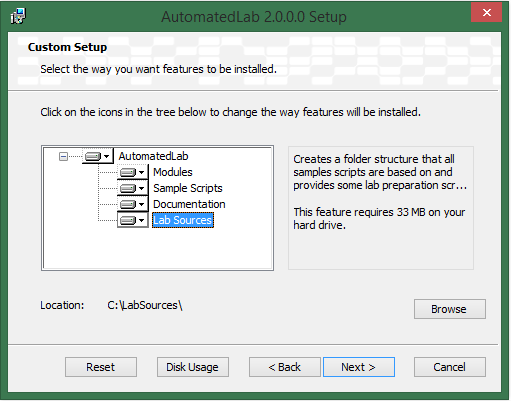
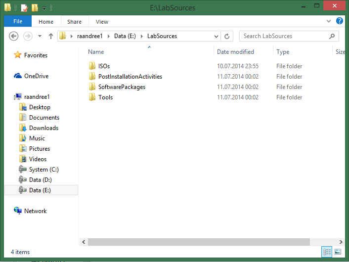
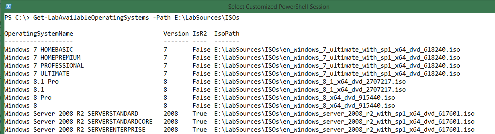
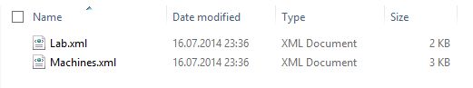

**Table of contents**
- [AutomatedLab Tutorial Part 2 Creating a Simple Lab with AutomatedLab](#automatedlab-tutorial-part-2-creating-a-simple-lab-with-automatedlab)
    - [Summary](#summary)
    - [Installation](#installation)
    - [Prerequisites for installing the first lab](#prerequisites-for-installing-the-first-lab)
    - [Creating the first lab](#creating-the-first-lab)
        - [Basic metadata information](#basic-metadata-information)
        - [Defining the lab](#defining-the-lab)
        - [Defining the network](#defining-the-network)
        - [Defining domains](#defining-domains)
        - [Adding ISOs to the lab](#adding-isos-to-the-lab)
        - [Credentials used to connect to the machines](#credentials-used-to-connect-to-the-machines)
        - [Defining roles](#defining-roles)
        - [Defining a lab machine](#defining-a-lab-machine)
        - [Exporting the lab](#exporting-the-lab)
    - [Installing the first lab](#installing-the-first-lab)
        - [Calling Install-Lab](#calling-install-lab)
        - [Removing the lab](#removing-the-lab)
    - [What is next](#what-is-next)
    - [The full script](#the-full-script)

AutomatedLab Tutorial Part 2 Creating a Simple Lab with AutomatedLab
======================================================================

Summary
-------

This blog article explains how to create a small lab environment using
AutomatedLab. After going through this article, you will have
AutomatedLab installed on you Hyper-V host and have a lab setup with two
machines.

Installation
------------

The installation of AutomatedLab itself, is very easy. You can download
AutomatedLab from <http://automatedlab.codeplex.com/>. The download will
consist of one MSI file.

After starting the installer (the MSI file), you get three options;
Typical, Custom or Complete. If you have more than one logical disks (or
even better, more than one physical disk), you can take advantage of
this and choose Custom.

{width="3.0724267279090114in"
height="2.411043307086614in"}

In time, the *Lab Sources* folder can grow quite large, so you might
want to choose another drive than drive C.

**Note:**

Feel free to change installation folders as you wish. However, for the
PowerShell modules coming with AutomatedLab to work (be imported)
automatically, the *Modules* are required to be installed either in the
user specific path of PowerShell modules
(C:\\Users\\&lt;user&gt;\\Documents\\WindowsPowerShell\\Modules) or the
computer specific path of PowerShell modules
(C:\\Windows\\System32\\WindowsPowerShell\\v1.0\\Modules).

Assuming that you did not change the default directories you will, after
performing the installation, have seven new PowerShell modules in the
directory user specific path of PowerShell modules,
C:\\Users\\&lt;user&gt;\\Documents\\WindowsPowerShell\\Modules.

In your documents folder, you will find the sample scripts and the
documentation (folder names: *AutomatedLab Sample Scripts* and
*AutomatedLab Documentation*).

An important part is the folder hierarchy of *Lab Sources*. The purpose
of this folder was explained in the last article of this series.

{width="3.8381977252843393in"
height="2.881187664041995in"}

Installation done.

Prerequisites for installing the first lab
------------------------------------------

Three requirements need to be verified, before a lab can be created:

1.  AutomatedLab required a Hyper-V on Windows Server 2012 R2 or Windows
    8.1

2.  The ISO files to be used during creation of the lab need to be
    present in *\\LabSources\\ISOs*

3.  PowerShell remoting needs to be enabled on the host machine

First thing to do, is to acquire ISO files/images for Windows Server
2012 R2 and Windows 8.1. The ISO files/images must provide a standard or
datacenter version of Windows Server 2012 R2 and a Windows 8.1 Pro or
Enterprise version.\
\
If you want to know which operating system versions your ISO files
contains, use the command:\
*Get-LabAvailableOperatingSystems -Path &lt;path&gt;*\
\
{width="6.3in" height="1.7131944444444445in"}

Enable PowerShell Remoting on the host computer. This is required as
described in the previous article. This has to be done just once.

Open an elevated PowerShell and type in the command
*Set-LabHostRemoting*.\
The output looks like this:

VERBOSE: starting log

VERBOSE: Set-LabHostRemoting Entering... )

VERBOSE: Remoting is enabled on the host machine

WARNING: TrustedHosts does not include '\*'. Replacing the currernt
value '' with '\*'

VERBOSE: Local policy 'Computer Configuration -&gt; Administrative
Templates -&gt; System -&gt; Credentials Delegation -&gt; Allow
Delegating Fresh Credentials'

configured correctly

VERBOSE: Local policy 'Computer Configuration -&gt; Administrative
Templates -&gt; System -&gt; Credentials Delegation -&gt; Allow
Delegating Fresh Credentials'

configured correctly

VERBOSE: Set-LabHostRemoting...leaving.

**Note:**

Because running the command *Set-LabHostRemoting* sets TrustedHosts to
‘\*’, your host computer will now allow (any) credentials to be sent
from your host computer to any other computer. This is a security risk
which you need to be aware of. If you will not allow this, you will need
to modify this configuration manually after running the command
*Set-LabHostRemoting*. You can modify trusted hosts by opening
gpedit.msc, go to “Computer Configuration\\Administrative Templates,
System, Credentials Delegation” and modify policies “Allow delegating
fresh credentials” and “Allow delegating fresh credentials with
NTLM-only server authentication”. Change content to only allow
credentials to be sent to the computers of your choice. For AutomatedLab
to work, you will need to enter names for all virtual machines
used/deployed using AutomatedLab.

Creating the first lab
----------------------

Now when the prerequisites are fulfilled, a lab can be created. Creating
a lab consists of different tasks which will be described in the
following.

### Basic metadata information

First, metadata information regarding where to look for data and where
to store data, needs to be defined. The information (files) which needs
to be read, are the files in the *LabSources* directory. The information
which needs to written, is the information about the lab definition (to
make is persist when exiting the PowerShell session and even restarting
the host computer). Also, information about where to store the VMs is
needed.

**Note:**

For performance reasons, it is a good idea to place the VMs on a
separate (physical) drive from the operating system, and preferably this
drive should be an SSD. AutomatedLab uses a parent disk for each
operating system, and creates differentiating disks for each VM using
the parent disks as base disks. By placing the ISO files/images on a
separate drive from the VMs (where the reference disks are also stored),
creating the reference disks will be faster (though this task only need
to be executed once as the parent disks are never modified they are
created).

Also, for performance reasons, it is highly recommended to exclude the
folder of the ISO files/images and the folder for the VMs from being
scanned by antivirus software (real time scanning).

In the following example, *Lab Sources* (containing the ISO
files/images) is placed on drive E which is a mechanical drive. The VMs
will be created on drive D which is an SSD.

\$labSources = 'E:\\LabSources' \#here are the lab sources

\$vmDrive = 'D:' \#this is the drive where to create the VMs

\$labName = 'FirstLab' \#the name of the lab, VM folder and network
switch

\#create the folder path for the lab using Join-Path

\$labPath = Join-Path -Path \$vmDrive -ChildPath \$labName

\#create the target directory if it does not exist

if (-not (Test-Path \$labPath)) { New-Item \$labPath -ItemType Directory
| Out-Null }

### Defining the lab

A lab definition is a set of data containing information about the lab
environment like lab name, network adapter, the domains and the
configuration of the machines (name, number of CPUs, amount of memory,
machine roles etc). This definition is created by calling
*New-LabDefinition*.

The following command will create a new lab definition:

New-LabDefinition -Path \$labPath -VmPath \$labPath -Name \$labName
-ReferenceDiskSizeInGB 60

### Defining the network

All virtual machines in the lab, need to have a network adapter. This
network adapter is connected to a Hyper-V virtual switch. Hence, this
Hyper-V virtual switch need to be created for the lab. By default, this
Hyper-V virtual switch will be created as an internal switch, providing
the host computer network access to the virtual machines and vice versa.
However, the virtual machines cannot connect to your physical network or
vice versa. Here, for simplicity, the network name will be the same as
the lab name.

\#define the network

Add-LabVirtualNetworkDefinition -Name \$labNetworkName -IpAddress
192.168.81.1 -PrefixLength 24

In this scenario, the lab is going to use IP addresses in the subnet
192.168.81.x which has the subnet mask 255.255.255.0. Hence, possible IP
addresses are 192.168.81.1-192.168.81.255

**Note:**

The IP address 192.168.81.1 will automatically be used as the IP address
of the Hyper-V virtual switch seen from the host operating system.
Hence, this IP address cannot be used for virtual machines in the lab.

### Defining domains

If you want to only create standalone machines (machines in a
workgroup), no domain is required. However, in this lab, there will be
one domain with (of course) one domain controller and one member server.
Hence, a domain needs to be defined for the lab. This domain definition
will the domain name, the administrator, and the password of the
administrator. This account is used for all domain related tasks like
the domain controller promotion, setting the DSRM/DSREPAIR password and
joining machines to the domain.

\#domain definition with the domain administrator account

Add-LabDomainDefinition -Name test1.net -AdminUser administrator
-AdminPassword Password1

### Adding ISOs to the lab

All required ISO files/images for software (operating systems, server
application and client applications) to be used in the lab, need to be
defined, for AutomatedLab to find it. If you add an operating system
ISO, you need to mark it with the IsOperatingSystem switch. The name
parameter is only used to uniquely identify the ISO definition and are
not used elsewhere. Name is free of choice (but has to be unique in the
lab).

\#these images are used to install the machines

Add-LabIsoImageDefinition -Name Server2012R2 -Path \$labSources\\ISOs\\
en\_windows\_server\_2012\_r2\_with\_update\_x64\_dvd\_4065220.iso

–IsOperatingSystem

### Credentials used to connect to the machines

For the initial machine setup of each virtual machine, a username and
password is needed to define the username and password of the local
administrator. This information is injected into a file named
*unattended.xml*. This file is then injected into each virtual machine
for performing the initial machine setup.

**Note/disclaimer:**

Creating a PSCredential object using a plain text password, is
absolutely not best practice for any production environment. However,
since this lab environment will not be a production environment, plain
text password will be used.

\#these credentials are used for connecting to the machines. As this is
a test lab we use clear-text passwords

\$installationCredential = New-Object PSCredential('Administrator',
('Password1' | ConvertTo-SecureString -AsPlainText -Force))

### Defining roles

Using roles, will be the easiest way in AutomatedLab to customize a
machine and set it up as required. In version 2.1.0, AutomatedLab
supports the following roles:

  RootDC          Root domain controller for a domain
  --------------- -------------------------------------------------------------------------------------
  FirstChildDC    First child domain controller for a domain
  DC              Additional domain controller for a domain
  DHCP            DHCP server role
  FileServer      File server role
  WebServer       Web server role (all web role services)
  SQLServer2012   SQL server 2012 with default instance
  Exchange2013    Exchange Server 2013
  Orchestrator    System Center Orchestrator 2012
  CaRoot          Enterprise or Standalone Root Certificate Authority (Windows 2012 or 2012R2)
  CaSubordinate   Enterprise or Standalone Subordinate Certificate Authority (Windows 2012 or 2012R2)
  Office2013      Microsoft Office 2013
  DevTools        Visual Studio 2012/2013

In this lab, only a single role will be used, the *RootDC* role. As the
lab will contain a domain, a new Active Directory forest is required,
and this of course requires a root domain controller. A requirement for
defining a root domain controller, is to provide the
*ForestFunctionalLevel* and the *DomainFunctionalLevel*. This
information is specified using a *properties* parameter which is a hash
table. There is no documentation yet for this part, so this is a good
opportunity to make mistakes. However, avoiding mistakes in regards to
this parameter is not crucial as all the lab definitions will be
validated by AutomatedLab before installation is actually started. The
validation component makes sure that, in our case, the parameters
*ForestFunctionalLevel* and the *DomainFunctionalLevel* is defined, and
that they are not higher than the version of the operating system of the
machine.

The cmdlet *Get-LabMachineRoleDefinition* has a *role* parameter and a
*properties* parameter. While the *properties* parameter is not
mandatory for some roles, it is mandatory for domain controllers.
Calling *Get-LabMachineRoleDefinition*, returns a role object. This role
object, is later used when defining a lab machine.

\$role = Get-LabMachineRoleDefinition -Role RootDC -Properties @{
DomainFunctionalLevel = 'Win2012R2'; ForestFunctionalLevel = 'Win2012R2'
}

### Defining a lab machine

Now, the first lab machine is defined using the cmdlet
*Add-LabMachineDefinition*. Here, the name of machine is provided as
well as basic information like number of CPUs, memory and IP
configuration.

Furthermore, it can be specified that the machine is to be domain
joined, will be in the domain *test1.net*, and that the machine should
have the root domain controller role (defined in the previous step).
This effectively results in defining, that we want a root domain
controller in the forest *test1.net*.

Next thing is to provide the installation credentials. These credentials
will be required to connect to the machine later, for doing
administrative tasks.

The *ToolsPath* parameter is optional, and points to a folder of your
choice on the host. When using this parameter, AutomatedLab will be copy
the content of this folder to all of the virtual machines in the lab,
prior to starting these. This is an effective way of copying tools and
utilities of your choice, to all of the virtual machines in the lab.

Finally, the operating system needs to be defined. This parameter is
restricted to a number of supported operating systems. PowerShell
IntelliSense helps you finding the desired value. Make sure to provide
the value in quotes (after the IntelliSense), as the operating system
names contain whitespaces.

Add-LabMachineDefinition -Name S1DC1 \`

-MemoryInMb 512 \`

-Network \$labNetworkName \`

-IpAddress 192.168.81.10 \`

-DnsServer1 192.168.81.10 \`

-DomainName test1.net \`

-IsDomainJoined \`

-Roles \$role \`

-InstallationUserCredential \$installationCredential \`

-ToolsPath \$labSources\\Tools \`

-OperatingSystem 'Windows Server 2012 R2 SERVERDATACENTER'

First machine is now defined.

Adding a second machine to the lab, is merely a copy/paste of the
previous cmdlet. Just the name and the IP address, are different as well
as this virtual machine will not be associated with any role. If no role
is defined, the virtual machine will be a plain member of the domain.

Add-LabMachineDefinition -Name S1Server1 \`

-MemoryInMb 512 \`

-Network \$labNetworkName \`

-IpAddress 192.168.81.20 \`

-DnsServer1 192.168.81.10 \`

-DomainName test1.net \`

-IsDomainJoined

-InstallationUserCredential \$installationCredential \`

-ToolsPath \$labSources\\Tools \`

-OperatingSystem 'Windows Server 2012 R2 SERVERDATACENTER'

### Exporting the lab

After configuring all lab definitions, you can export the lab
configuration using the cmdlet *Export-LabDefinition*. This cmdlet
creates two XML files in the directory ‘D:\\FirstLab’. These files will
contain the configuration of the lab, making them persistent.

Export-LabDefinition -ExportDefaultUnattendedXml –Force

{width="5.427083333333333in"
height="1.0104166666666667in"}

The Force switch overwrites existing files without asking for
permission.

Installing the first lab
------------------------

After configuring all lab definitions and the configuration has been
exported (saved to disk), the lab can be installed. This is done using
just one cmdlet; *Install-Lab*. Using different switches, you can
activate different tasks to be performed by *Install-Lab*;:

  **Switch**               **Task**
  ------------------------ -----------------------------------------------------------------------------------------------------------------------------------------------------
  NetworkSwitches          Creates the virtual switch
  BaseImages               Creates all parent disks
  VMs                      Creates and configures all the Hyper-V virtual machines
  Domains                  Starts installation of all domain controllers starting with root domain controllers, then child domain controller and additional domain controllers
  DHCP                     Installs DHCP role on machines where this role is specified
  CA                       Installs the Certificate Authority roles if specified
  PostInstallations        Starts on post installation actions
  SQLServer2012            Installs SQL server on machines where this role is specified
  Orchestrator             Installs SC Orchestrator on machines where this role is specified
  WebServers               Installs Web server role on machines where this role is specified
  Exchange2013             Installs Exchange Server on machines where this role is specified
  DevTools                 Installs DevTools (Visual Studio) on machines where this role is specified
  Office2013               Installs Office 2013 where this role is specified
  StartRemainingMachines   Starts all remaining machines (the machines which has not yet been started)

### Calling Install-Lab

As the current lab contains only a domain controller and a member
machine, the following tasks (parameters for *Install-Lab*) are needed:

-   NetworkSwitches: This created the virtual switch. By default, the
    virtual switch is an internal switch. Hence, the VMs cannot connect
    to any network resources outside of the lab (and the host).

-   BaseImages: AutomatedLab will create one base image for every
    operating system as described in the preceding article. All VMs will
    use these disks as parent disks.

-   VMs: This actually creates/configures each VMs using differencing
    disks.

-   Domains: This installs all domain controllers. In one lab, it is
    possible to create multiple forests, multiple child domains or
    domain trees and use both RODCs and RWDCs. This tasks will install
    all domain controller specific roles.

-   StartRemainingMachines: All machines defined in the lab which have
    not yet been started, will be started in this task. This tasks is
    important, as starting the machines triggers the unattended
    installation based in the XML files AutomatedLab created for you.
    This unattended.xml file contains configuration for each machine
    such as computer name, IP address, locale, domain and much more.

In this example, *Install-Lab* is called three times to separate the
process. However you can start all tasks in a single call as well by
using all required switch parameters.

Install-Lab -NetworkSwitches -BaseImages -VMs

\#This sets up all domains / domain controllers

Install-Lab -Domains

\#Start all machines which have not yet been started

Install-Lab -StartRemainingMachines

The above tasks, will take a considerable amount of time, and will
depend on the speed of you disk(s). When the above tasks are completed,
the lab is ready to use. Congratulations!

### Removing the lab

If in need of removing a lab, removing the small lab described in this
article, is quite easy. However, if a lab of 10+ machines needs to be
removed, the task becomes tedious. AutomatedLab also contains a cmdlet
which can help cleanup all machines used in a lab. The cmdlet
*Remove-Lab* first removes all the VMs used in a lab, then the disks and
finally the network adapter. This way, if required, it is possible to
install the lab, test what needs to be tested, and remove the lab again.
This enables you to sequentially perform lab installations first, then
perform tests in the lab, remove the lab, install a new lab, perform
tests etc. Of course, checkpoints are also available enabling you to
revert to these. One of the next articles will show how you can take
advantage of this functionality.

What is next
------------

The next article describes, as mentioned, how checkpoints work in
AutomatedLab and how to define your own Post Installation Activities to
help you customize your lab even further.

The full script
---------------

This is how the full script should look like after putting all the
pieces together.

\$start = Get-Date

\$labSources = 'E:\\LabSources' \#here are the lab sources

\$vmDrive = 'D:' \#this is the drive where to create the VMs

\$labName = 'FirstLab' \#the name of the lab, VM folder and network
Switch

\#create the folder path for the lab using Join-Path

\$labPath = Join-Path -Path \$vmDrive -ChildPath \$labName

\#create the target directory if it does not exist

if (-not (Test-Path \$labPath)) { New-Item \$labPath -ItemType Directory
| Out-Null }

New-LabDefinition -Path \$labPath -VmPath \$labPath -Name \$labName
-ReferenceDiskSizeInGB 60

Add-LabVirtualNetworkDefinition -Name \$labName -IpAddress 192.168.81.1
-PrefixLength 24

Add-LabDomainDefinition -Name test1.net -AdminUser administrator
-AdminPassword Password1

Add-LabIsoImageDefinition -Name Server2012R2 -Path
\$labSources\\ISOs\\en\_windows\_server\_2012\_r2\_with\_update\_x64\_dvd\_4065220.iso
–IsOperatingSystem

\$installationCredential = New-Object PSCredential('Administrator',
('Password1' | ConvertTo-SecureString -AsPlainText -Force))

\$role = Get-LabMachineRoleDefinition -Role RootDC -Properties @{
DomainFunctionalLevel = 'Win2012R2'; ForestFunctionalLevel = 'Win2012R2'
}

Add-LabMachineDefinition -Name S1DC1 \`

-MemoryInMb 512 \`

-Network \$labName \`

-IpAddress 192.168.81.10 \`

-DnsServer1 192.168.81.10 \`

-DomainName test1.net \`

-IsDomainJoined \`

-Roles \$role \`

-InstallationUserCredential \$installationCredential \`

-ToolsPath \$labSources\\Tools \`

-OperatingSystem 'Windows Server 2012 R2 SERVERDATACENTER'

Add-LabMachineDefinition -Name S1Server1 \`

-MemoryInMb 512 \`

-Network \$labName \`

-IpAddress 192.168.81.20 \`

-DnsServer1 192.168.81.10 \`

-DomainName test1.net \`

-IsDomainJoined \`

-InstallationUserCredential \$installationCredential \`

-ToolsPath \$labSources\\Tools \`

-OperatingSystem 'Windows Server 2012 R2 SERVERDATACENTER'

Export-LabDefinition –Force -ExportDefaultUnattendedXml

Import-Lab -Path (Get-LabDefinition).LabFilePath

Install-Lab -NetworkSwitches -BaseImages -VMs

\#This sets up all domains / domain Controllers

Install-Lab -Domains

\#Start all machines which have not yet been started

Install-Lab -StartRemainingMachines

\$end = Get-Date

Write-Host "Setting up the lab took \$(\$end - \$start)"
