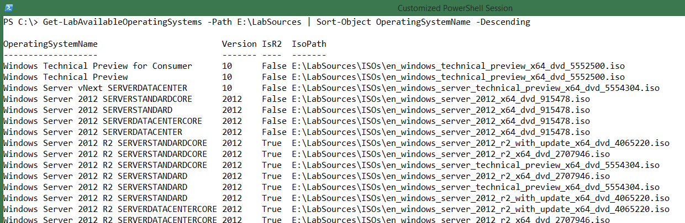

**Table of contents**
- [AutomatedLab Tutorial Part 3 Working with Predefined Server Roles](#automatedlab-tutorial-part-3-working-with-predefined-server-roles)
    - [Summary](#summary)
    - [Installation](#installation)
    - [Prerequisites for extending the lab](#prerequisites-for-extending-the-lab)
    - [Remove the previous lab](#remove-the-previous-lab)
    - [Setting up the new lab](#setting-up-the-new-lab)
        - [Add the required ISOs to the lab](#add-the-required-isos-to-the-lab)
        - [Changing the operating system](#changing-the-operating-system)
        - [Exchange Machine Role](#exchange-machine-role)
        - [Exchange Server Definition](#-exchange-server-definition)
        - [SQL2012 Role and Server Definition](#-sql2012-role-and-server-definition)
        - [Exporting the lab](#exporting-the-lab)
    - [Installing process](#installing-process)
    - [Creating Checkpoints of the Whole Lab Environment](#creating-checkpoints-of-the-whole-lab-environment)
    - [Removing the lab](#removing-the-lab)
    - [Further Available Roles](#further-available-roles)
    - [What?s next?](#what?s-next?)
    - [The Full Script](#the-full-script)

AutomatedLab Tutorial Part 3 Working with Predefined Server Roles
===================================================================

Summary
-------

The last blog article explained how to create a small lab environment
using AutomatedLab. This article covers how to extend the lab created in
the previous article by predefined server roles and switch the operating
system to Windows 10 Technical Preview.

Installation
------------

If you have a pre-2.5 version of AutomatedLab installed, please
uninstall it and install the latest version from
<http://automatedlab.codeplex.com/>.

The installation process of AutomatedLab is covered in the article
[AutomatedLab Introduction - Part
2](http://blogs.technet.com/b/fieldcoding/archive/2014/07/27/automatedlab-introduction-part-2.aspx).

Prerequisites for extending the lab
-----------------------------------

Today our goal is to extend the lab we created in Part 2 of this series.
The steps described in Part 2 must be completed before you attempt this
process.

Adding operating systems and products requires that the respective ISO
images are available on the Hyper-V host. The following ISO images need
to be downloaded to the \\LabSources\\ISOs folder:

-   Windows Server Technical Preview (x64) - DVD (English)

-   Exchange Server 2013 with Service Pack 1 (x64)

-   SQL Server 2012 R2

Later, the operating system for all the machines in the lab needs to be
changed to have AutomatedLab install Windows 10 Technical Preview. You
can get a list of available operating systems by using the cmdlet
**Get-LabAvailableOperatingSystems**. When you point to the
**LabSources** folder, the cmdlet will mount each ISO found in the
folder hierarchy and return the available operating systems.

{width="6.3in" height="2.057638888888889in"}

Note The output shows that the operating system name you are going to
use later is '**Windows Server vNext SERVERDATACENTER**'.

Remove the previous lab
-----------------------

If the test lab that we created in the previous post still exists on the
Hyper-V host, it needs to be removed. This is required because the
domain controller should run on Windows 10 and the Active Directory
forest needs to be re-created.

To remove the existing lab, open an elevated command prompt in Windows
PowerShell and run the following command:

Remove-Lab –Path &lt;LabPath&gt;\\Lab.xml

Warning: This command removes the virtual machines running Hyper-V, the
VHDs, and the virtual network switch. There is no way to undo this
change.

The **Remove-Lab** cmdlet is also quite helpful if you have to perform
tests multiple times and you do not want to use checkpoints. Creating a
lab over and over again requires calling the lab build script. Removing
a large lab with many virtual machines can be quite a boring task and
fault prone (for example, forgetting to remove a virtual machine or
VHD). The more you use AutomatedLab, the more you will become accustomed
to removing an entire lab because the rebuild takes only minutes.

Setting up the new lab
----------------------

### Add the required ISOs to the lab

To set up the new lab, first add the required ISOs to the lab.
AutomatedLab needs to know about the ISO for Windows Server Technical
Preview. The cmdlet **Add-LabIsoImageDefinition** adds the definition to
the lab. It is important to flag the image as **IsOperatingSystem**. The
name of the image does not matter, but it needs to be unique.

Add-LabIsoImageDefinition -Name Win10 -Path
\$labSources\\ISOs\\en\_windows\_server\_technical\_preview\_x64\_dvd\_5554304.iso
–IsOperatingSystem

The next ISOs that need to be added are the Exchange Server 2013 and the
SQL Server 2012 images:

Add-LabIsoImageDefinition -Name Exchange2013 -Path
\$labSources\\ISOs\\mu\_exchange\_server\_2013\_with\_sp1\_x64\_dvd\_4059293.iso

Add-LabIsoImageDefinition -Name SQLServer2012 -Path
\$labSources\\ISOs\\en\_sql\_server\_2012\_standard\_edition\_with\_sp1\_x64\_dvd\_1228198.iso

### Changing the operating system

The lab that we created in Part 2 contains two machines: S1DC1 and
S1Server1. We need to change the operating system of the two machines in
the existing lab. This is a simple find and replace operation. Replace
the string **'Windows Server 2012 R2 SERVERDATACENTER'** with **'Windows
Server vNext SERVERDATACENTER'**.

The definition of the domain controller looks like this:

\$role = Get-LabMachineRoleDefinition -Role RootDC -Properties @{
DomainFunctionalLevel = 'Win2012R2'; ForestFunctionalLevel = 'Win2012R2'
}

Add-LabMachineDefinition -Name S1DC1 \`

> -MemoryInMb 512 \`
>
> -Network \$labName \`
>
> -IpAddress 192.168.81.10 \`
>
> -DnsServer1 192.168.81.10 \`
>
> -DomainName test1.net \`
>
> -IsDomainJoined \`
>
> -Roles \$role \`
>
> -InstallationUserCredential \$installationCredential \`
>
> -ToolsPath \$labSources\\Tools \`
>
> -OperatingSystem 'Windows Server vNext SERVERDATACENTER'

### Exchange Machine Role

The easiest way to configure machines in AutomatedLab is by using roles.
However, assigning a role to a machine is not mandatory. You can also
configure things manually. You can find a list of available roles that
are available in AutomatedLab in [AutomatedLab Tutorial Part 2: Create a
Simple
Lab](http://blogs.technet.com/b/fieldcoding/archive/2014/07/27/automatedlab-introduction-part-2.aspx).

To add a server running Exchange Server 2013 to the current lab, the
respective role needs to be selected. Use the
**Get-LabMachineRoleDefinition** cmdlet for that by providing the role
and additional information as a hash table.

A basic Exchange Server 2013 installation needs the following additional
information:

-   **OrganizationName**

The name assigned to the new Exchange Server organization.

-   **DependencySourceFolder **

> Exchange Server 2013 has some prerequisites that need to be installed.
> AutomatedLab needs to know where to find these files.

If you forget to specify these values, the AutomatedLab validator
creates an error, and the installation will not start.

To name the organization **'TestOrg'** and point to the
**SoftwarePackages** folder in **LabSources** (the folder that contains
all AutomatedLab resources), use the following command:

\$role = Get-LabMachineRoleDefinition -Role Exchange -Properties @{
OrganizationName = 'TestOrg'; DependencySourceFolder =
"\$labSources\\SoftwarePackages" }

### Exchange Server Definition

The Exchange Server role is now stored in a variable and the next task
is to define the new machine that is going to run Exchange Server.
Simply copy one of the servers to the clipboard and paste the machine
under the **S1Server1**.

Remember to give the new machine a new name and IP address. We also
recommend that you give the Exchange Server more RAM. Finally, the
previously created role needs to be assigned to this machine. Now you
have the full server definition for Exchange Server 2013 running on
Windows 10 Technical Preview. Here is the script:

Add-LabMachineDefinition -Name S1Ex1 \`

> -MemoryInMb 4096 \`
>
> -Network \$labName \`
>
> -IpAddress 192.168.81.21 \`
>
> -DnsServer1 192.168.81.10 \`
>
> -DomainName test1.net \`
>
> -IsDomainJoined \`
>
> -Role \$role \`
>
> -InstallationUserCredential \$installationCredential \`
>
> -ToolsPath \$labSources\\Tools \`
>
> -OperatingSystem 'Windows Server vNext SERVERDATACENTER'

### SQL2012 Role and Server Definition

AutomatedLab does a standard installation for SQL Server 2012. There are
no customizations supported yet. Therefore, defining the role for SQL
Server 2012 is easier, and it does not take additional parameters.
Defining the SQL Server is also a mere copy and paste:

\$role = Get-LabMachineRoleDefinition -Role SQLServer2012

Add-LabMachineDefinition -Name S1Sql1 \`

> -MemoryInMb 4096 \`
>
> -Network \$labName \`
>
> -IpAddress 192.168.81.22 \`
>
> -DnsServer1 192.168.81.10 \`
>
> -DomainName test1.net \`
>
> -IsDomainJoined \`
>
> -Role \$role \`
>
> -InstallationUserCredential \$installationCredential \`
>
> -ToolsPath \$labSources\\Tools \`
>
> -OperatingSystem 'Windows Server vNext SERVERDATACENTER'

**Note:** See the predefined **PostInstallationActivity** for SQL
Server. It installs the common sample databases, Northwind and Pubs.

### Exporting the lab

After configuring all lab definitions, you can export the lab
configuration by using the **Export-LabDefinition** cmdlet. This cmdlet
creates two XML files in the directory D:\\FirstLab. These files contain
the configuration of the lab, which makes them persistent.

Export-LabDefinition –Force

{width="5.427083333333333in"
height="1.0104166666666667in"}

**Note:** The Force switch overwrites existing files without asking for
permission.

Installing process
------------------

All the lab definitions are complete. The
installation of the lab is triggered with the **Install-Lab** cmdlet.
But first the lab that was exported to XML needs to be imported. When a
lab definition is importing, it runs through validators that to ensure
that it is consistent and it can be installed. The next four lines are
doing the actual hard work.

Import-Lab -Path (Get-LabDefinition).LabFilePath

Install-Lab -NetworkSwitches -BaseImages -VMs

\#This sets up all Domains / Domain Controllers

Install-Lab -Domains

\#Start the SQL Server 2012 Installation

Install-Lab –SQLServer2012

\#Start the Exchange 2013 Installation

Install-Lab -Exchange2013

\#Start all machines which have not yet been started

Install-Lab -StartRemainingMachines

**Note:** For details about the installation process, refer to the
previous two posts in this series.

Creating Checkpoints of the Whole Lab Environment
-------------------------------------------------

AutomatedLab comes with an easy solution to manage checkpoints for
multiple machines. There is no need to handle checkpoints by using the
GUI in Hyper-V or by creating Windows PowerShell loops.

The **Checkpoint-LabVM** cmdlet can take checkpoints of a single machine
or multiple machines (like the Hyper-V cmdlet). It can also take
checkpoints of the whole lab, which is accomplished by using the switch
parameter **All**, for example:

Checkpoint-LabVM -All -SnapshotName 'InstallationDone'

To restore from the checkpoint, simply use the following command:

Restore-LabVMSnapshot -All -SnapshotName 'InstallationDone'

You can also restore specific checkpoint from all machines by using the
**Restore-LabVMSnapshot** cmdlet:

Restore-LabVMSnapshot -All -SnapshotName '&lt;SomeName&gt;'

**Note:** When you call Checkpoint-LabVM, all virtual machines in the
lab are paused before taking the checkpoints. This makes sure that
checkpoints on all machines are captured at the same time, which is
important for Active Directory replication, for instance. However, there
can be a gap of one or two seconds, so this feature may not be suitable
for all products or scenarios.

Removing the lab
----------------

Removing the small lab described in this post is quite easy. However, if
a lab of 10+ machines needs to be removed, the task becomes tedious.
AutomatedLab also contains a cmdlet that can help clean up all the
machines used in a lab.

The **Remove-Lab** cmdlet first removes all the virtual machines used in
a lab, then the disks, and finally the network adapter. This enables you
to sequentially perform lab installations first, then perform tests in
the lab, remove the lab, install a new lab, perform tests, and so on.

Of course, checkpoints that enable you to revert are also available. One
of the later blog posts in this series will show how you can take
advantage of this functionality.

Further Available Roles
-----------------------

There are other roles available:

  RootDC          Root domain controller for a domain
  --------------- -------------------------------------------------------------------------------------
  FirstChildDC    First child domain controller for a domain
  DC              Additional domain controller for a domain
  DHCP            DHCP server role
  FileServer      File server role
  WebServer       Web server role (all web role services)
  SQLServer2014   SQL server 2014 with default instance
  SQLServer2012   SQL server 2012 with default instance
  Exchange2013    Exchange Server 2013
  Orchestrator    System Center Orchestrator 2012
  CaRoot          Enterprise or Standalone Root Certificate Authority (Windows 2012 or 2012R2)
  CaSubordinate   Enterprise or Standalone Subordinate Certificate Authority (Windows 2012 or 2012R2)
  Office2013      Microsoft Office 2013
  DevTools        Visual Studio 2012/2013

For details about the roles and the installation process, refer to the
previous two articles of this series.

What’s next?
------------

The next article describes, how AutomatedLab can be used to setup a PKI

The Full Script
---------------

This is how the full script should look like after putting all the
pieces together.

\$start = Get-Date

\$labSources = 'E:\\LabSources' \#here are the lab sources

\$vmDrive = 'D:' \#this is the drive where to create the VMs

\$labName = 'FirstLab' \#the name of the lab, VM folder and network
Switch

\#create the folder path for the lab using Join-Path

\$labPath = Join-Path -Path \$vmDrive -ChildPath \$labName

\#create the target directory if it does not exist

if (-not (Test-Path \$labPath)) { New-Item \$labPath -ItemType Directory
| Out-Null }

New-LabDefinition -Path \$labPath -VmPath \$labPath -Name \$labName
-ReferenceDiskSizeInGB 60

Add-LabVirtualNetworkDefinition -Name \$labName -IpAddress 192.168.81.1
-PrefixLength 24

Add-LabDomainDefinition -Name test1.net -AdminUser administrator
-AdminPassword Password1

Add-LabIsoImageDefinition -Name Win10 -Path
\$labSources\\ISOs\\en\_windows\_server\_technical\_preview\_x64\_dvd\_5554304.iso
–IsOperatingSystem

Add-LabIsoImageDefinition -Name Exchange2013 -Path
\$labSources\\ISOs\\mu\_exchange\_server\_2013\_with\_sp1\_x64\_dvd\_4059293.iso

Add-LabIsoImageDefinition -Name SQLServer2012 -Path
\$labSources\\ISOs\\en\_sql\_server\_2012\_standard\_edition\_with\_sp1\_x64\_dvd\_1228198.iso

\$installationCredential = New-Object PSCredential('Administrator',
('Password1' | ConvertTo-SecureString -AsPlainText -Force))

\$role = Get-LabMachineRoleDefinition -Role RootDC -Properties @{
DomainFunctionalLevel = 'Win2012R2'; ForestFunctionalLevel = 'Win2012R2'
}

Add-LabMachineDefinition -Name S1DC1 \`

> -MemoryInMb 512 \`
>
> -Network \$labName \`
>
> -IpAddress 192.168.81.10 \`
>
> -DnsServer1 192.168.81.10 \`
>
> -DomainName test1.net \`
>
> -IsDomainJoined \`
>
> -Roles \$role \`
>
> -InstallationUserCredential \$installationCredential \`
>
> -ToolsPath \$labSources\\Tools \`
>
> -OperatingSystem 'Windows Server vNext SERVERDATACENTER'

Add-LabMachineDefinition -Name S1Server1 \`

> -MemoryInMb 512 \`
>
> -Network \$labName \`
>
> -IpAddress 192.168.81.20 \`
>
> -DnsServer1 192.168.81.10 \`
>
> -DomainName test1.net \`
>
> -IsDomainJoined \`
>
> -InstallationUserCredential \$installationCredential \`
>
> -ToolsPath \$labSources\\Tools \`
>
> -OperatingSystem 'Windows Server vNext SERVERDATACENTER'

\$role = Get-LabMachineRoleDefinition -Role Exchange -Properties @{
OrganizationName = 'TestOrg'; DependencySourceFolder =
"\$labSources\\SoftwarePackages" }

Add-LabMachineDefinition -Name S1Ex1 \`

> -MemoryInMb 4096 \`
>
> -Network \$labName \`
>
> -IpAddress 192.168.81.21 \`
>
> -DnsServer1 192.168.81.10 \`
>
> -DomainName test1.net \`
>
> -IsDomainJoined \`
>
> -Role \$role \`
>
> -InstallationUserCredential \$installationCredential \`
>
> -ToolsPath \$labSources\\Tools \`
>
> -OperatingSystem 'Windows Server vNext SERVERDATACENTER'

\$role = Get-LabMachineRoleDefinition -Role SQLServer2012

Add-LabMachineDefinition -Name S1Sql1 \`

> -MemoryInMb 4096 \`
>
> -Network \$labName \`
>
> -IpAddress 192.168.81.22 \`
>
> -DnsServer1 192.168.81.10 \`
>
> -DomainName test1.net \`
>
> -IsDomainJoined \`
>
> -Role \$role \`
>
> -InstallationUserCredential \$installationCredential \`
>
> -ToolsPath \$labSources\\Tools \`
>
> -OperatingSystem 'Windows Server vNext SERVERDATACENTER'

Export-LabDefinition -ExportDefaultUnattendedXml –Force

Import-Lab -Path (Get-LabDefinition).LabFilePath

Install-Lab -NetworkSwitches -BaseImages -VMs

\#This sets up all Domains / Domain Controllers

Install-Lab -Domains

\#Start the SQL Server 2012 Installation

Install-Lab –SQLServer2012

\#Start the Exchange 2013 Installation

Install-Lab -Exchange2013

\#Start all machines which have not yet been started

Install-Lab –StartRemainingMachines

\$end = Get-Date

Write-Host "Setting up the lab took \$(\$end - \$start)"
