**Table of contents**
- [AL Tutorial Series Part 4 Installing a simple PKI environment](#al-tutorial-series-part-4-installing-a-simple-pki-environment)
    - [Summary](#summary)
    - [Installation](#installation)
    - [Prerequisites for AutomatedLab](#prerequisites-for-automatedlab)
    - [Prerequisites for installing a certificate authority in the lab](#prerequisites-for-installing-a-certificate-authority-in-the-lab)
    - [Defining the lab machines](#defining-the-lab-machines)
        - [Customizing the configuration of the CA](#customizing-the-configuration-of-the-ca)
    - [Supported PKI configurations in AutomatedLab](#supported-pki-configurations-in-automatedlab)
    - [Making use of the Certificate Authority in the Lab](#making-use-of-the-certificate-authority-in-the-lab)
        - [Requesting a certificate for a user](#requesting-a-certificate-for-a-user)
        - [Requesting a certificate for a computer](#requesting-a-certificate-for-a-computer)
        - [Enabling auto enrollment of certificates](#enabling-auto-enrollment-of-certificates)
    - [What is next](#what -is-next)
    - [The Full Script](#the-full-script)

AL Tutorial Series Part 4 Installing a simple PKI environment
===============================================================

Summary
-------

This blog article will show how to easily deploy a PKI environment using
**AutomatedLab**. The PKI environment will be a single server installed
with the CA (Certificate Authority) role. Subsequently, you will then be
able to request and issue certificates to all computers and users in
your lab. Also, if you want to be able to sign PowerShell scripts in the
lab, a certificate can be created for this purpose.

The home, and where to get **AutomatedLab** is:
<https://automatedlab.codeplex.com/>

Installation
------------

If you have a pre-2.5 version of AutomatedLab installed, please
uninstall it and install the latest version from
<http://automatedlab.codeplex.com/>.

The installation process of AutomatedLab is covered in the article
[AutomatedLab Introduction - Part
2](http://blogs.technet.com/b/fieldcoding/archive/2014/07/27/automatedlab-introduction-part-2.aspx).

Prerequisites for AutomatedLab
------------------------------

AutomatedLab requires **Hyper-V** and **PowerShell 3.0** (or higher).
Hence, you need one of the following operating systems on the host where
you want to install the lab:

-   Windows Server 2012/2012R2

-   Windows 8

-   Windows 8.1

Although Windows Server 2008 R2 could work and Windows 10 hasn’t been
tested, it is recommended at this point to use Windows Server
2012/2012R2 or Windows 8/8.1 on the host machine.

AutomatedLab scripts needs to be executing directly on the host where
the lab environment (the VMs) will be installed/created.

For more information about the overall installation process, refer to
the previous articles.

Prerequisites for installing a certificate authority in the lab
---------------------------------------------------------------

There are really no prerequisites other than the server where the
certificate authority roles will be installed on, need to be at least
Windows Server 2012.

The Certificate Authority role can be of two different types;
**Stand-Alone** or **Enterprise**. The major difference from the point
of the installation, is that the Enterprise type of Certificate
Authority requires the server to be domain joined and the account used
during installation of the role needs to have domain admin permission.

The type of CA installed in this article, will be of the type
**Enterprise**.

Defining the lab machines
-------------------------

For simplicity, we will use two machines. One machine will be become a
Domain Controller and the other machine will become the Certificate
Authority server. The Domain Controller is defined like this (Refer to
the previous articles for details about defining machine roles):

\$role = Get-LabMachineRoleDefinition -Role RootDC \`

-Properties @{DomainFunctionalLevel = "Win2012R2"

ForestFunctionalLevel = "Win2012R2"}

Add-LabMachineDefinition -Name S1DC1 -MemoryInMb 512 \`

-Network \$labNetworkName -IpAddress 192.168.81.10 -DnsServer1
192.168.81.10 \`

-DomainName test1.net -IsDomainJoined \`

-Roles \$role \`

-InstallationUserCredential \$installationCredential \`

-ToolsPath \$labSources\\Tools \`

-OperatingSystem 'Windows Server 2012 R2 SERVERDATACENTER'

Since the Certificate Authority (like domain controller) is a **role**
in AutomatedLab, this **role** needs to be specified when defining the
lab machine. The role is selected using the cmdlet
**Get-LabMachineRoleDefinition** like this:

\$role = Get-LabMachineRoleDefinition -Role CaRoot

Next, the lab machine can defined using the selected role.

Add-LabMachineDefinition -Name S1CA1 \`

-MemoryInMb 512 \`

-Network \$labNetworkName \`

-IpAddress 192.168.81.11 \`

-DnsServer1 192.168.81.10 \`

-DomainName test1.net \`

-IsDomainJoined \`

-Roles \$role \`

-InstallationUserCredential \$installationCredential \`

-ToolsPath \$labSources\\Tools \`

-OperatingSystem 'Windows Server 2012 R2 SERVERDATACENTER'

After defining the lab machines, start the installation of the lab like
usual. This would mean, export the lab definition, import it (which also
validates the configuration and reports any errors) and finally start
the actual installation which will create virtual network, create base
images, create Hyper-V VMs and install the roles found in the lab.

The code for this, looks like this:

Export-LabDefinition -Force -ExportDefaultUnattendedXml

Import-Lab -Path (Get-LabDefinition).LabFilePath

Install-Lab -NetworkSwitches -BaseImages -VMs

Install-Lab -Domains

At this point, the Domain Controller is installed and ready. Now the
installation of the Certificate Authority needs to be started. This is
done like this:

Install-Lab -CA

Notice that you do not need to instruct the cmdlet **Install-Lab** about
*how* to install the CA and how it should be configured. This will done
automatically.

Now, the lab is ready with a Domain Controller (hosting a domain of
course) and with an Enterprise CA. Now, you can request and issue
certificates (from the Subordinate CA) for use in your lab!

### Customizing the configuration of the CA

The first install was very easy as all configuration is automatically
done when plainly calling **Install-Lab -CA.** Now, let’s try installing
a PKI environment where we define some of the configuration of the CA
ourselves. Even though the default installation will work in the far
majority of situations for a test lab, it could be necessary to specify
certain parts of the configuration for the PKI environment.

First of all, the current lab needs to be removed. Do this by calling

Remove-Lab -Path &lt;path to the **lab.xml** file&gt;

The cmdlet **Remove-Lab** (turns off and) removes the VMs, the disks and
finally the network adapter.

First off, the Domain and the Domain Controller needs to be defined as
before.

\$role = Get-LabMachineRoleDefinition -Role RootDC \`

> -Properties @{DomainFunctionalLevel = "Win2012R2"
>
> ForestFunctionalLevel = "Win2012R2"}

Add-LabMachineDefinition -Name S1DC1 \`

-MemoryInMb 512 \`

-Network \$labNetworkName \`

-IpAddress 192.168.81.10 \`

-DnsServer1 192.168.81.10 \`

-DomainName test1.net \`

-IsDomainJoined \`

-Roles \$role \`

-InstallationUserCredential \$installationCredential \`

-ToolsPath \$labSources\\Tools \`

-OperatingSystem 'Windows Server 2012 R2 SERVERDATACENTER'

Now, when defining the role of the CA, we have the option of specifying
configuration parameters. Take a look at the following:

\$role = Get-LabMachineRoleDefinition \`

-Role CaRoot @{CACommonName = "MySpecialRootCA1"

KeyLength = “2048”

ValidityPeriod = "Weeks"

ValidityPeriodUnits = "4"}

Next, the lab machine can defined using the selected role with the
customized configuration. This command is the same as before. Only the
contents of the \$role variable is different.

Add-LabMachineDefinition -Name S1CA1 -MemoryInMb 512 \`

-Network \$labNetworkName \`

-IpAddress 192.168.81.11 \`

-DnsServer1 192.168.81.10 \`

-DomainName test1.net \`

-IsDomainJoined \`

-Roles \$role \`

-InstallationUserCredential \$installationCredential \`

-ToolsPath \$labSources\\Tools \`

-OperatingSystem 'Windows Server 2012 R2 SERVERDATACENTER'

Just as before, perform the actual installation of the lab using:

Export-LabDefinition -Force -ExportDefaultUnattendedXml

Import-Lab -Path (Get-LabDefinition).LabFilePath

Install-Lab -NetworkSwitches -BaseImages -VMs

Install-Lab –Domains

Install-Lab -CA

Also notice that the command for installing the CA is the same as
before. Difference is that now the parameters specified in the **role**
parameter will be passed to the CA installation code.

Now, **this time**, the lab is ready with a Domain Controller (hosting a
domain of course) and with an Enterprise CA configured **using our
customized parameters**.

To see what parameters is possible to specify when installing a CA
server in AutomatedLab, you can type the following:

Get-Help Install-LWLabCAServers -Parameter \*

Then you will see all possible parameters. To see just the names of the
parameters (without the detailed information), type:

(Get-Command Install-LWLabCAServers).Parameters.Keys

Changing the parameters for the CA servers to be installed, requires you
to know about how the corresponding configuration parameters for CA
servers are working. Hence, it is only recommended to specify/customize
parameters if you know about PKI and thereby have the need to
specify/customize parameters.

Supported PKI configurations in AutomatedLab
--------------------------------------------

AutomatedLab supports 1-tier and 2 tier deployments of PKI. This means
that you can deploy a Root CA solely or you can deploy a Root CA and a
Subordinate CA to this Root CA.

Also, only deployments of PKI in the same AD forest are supported.
Deployment of a Root CA in one AD forest and a Subordinate CA in another
AD forest where this Subordinate CA is subordinate to the first
mentioned Root CA, is not supported.

Making use of the Certificate Authority in the Lab
--------------------------------------------------

### Requesting a certificate for a user

Now, it is possible to request certificates from the CA server. We will
now perform a manual request using the Web Enrollment interface on the
CA server.

On the CA server, in a browser, go to <http://localhost/CertSrv>.
Following web site is displayed:

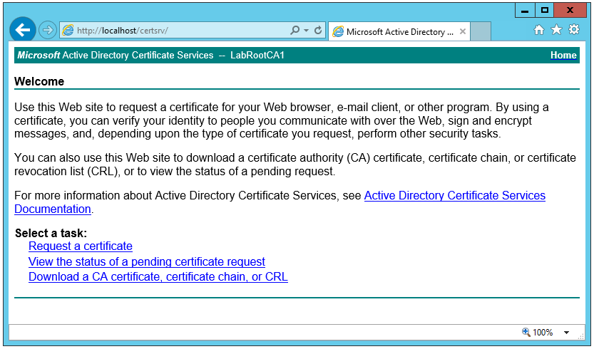{width="6.043806867891513in"
height="3.553846237970254in"}

Go to **Internet Options** and to the **Security** tab. Click on Custom
level and find the setting called **Initialize and script ActiveX
controls not marked as safe for scripting** and set it to **Enabled**.

Now, click **Request a certificate**

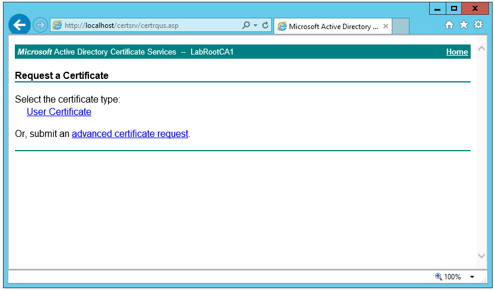{width="6.050536964129484in"
height="3.5461537620297463in"}

Click **User Certificate**

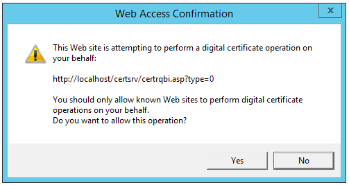{width="3.7869531933508314in"
height="2.0076924759405075in"}

Click **Yes**

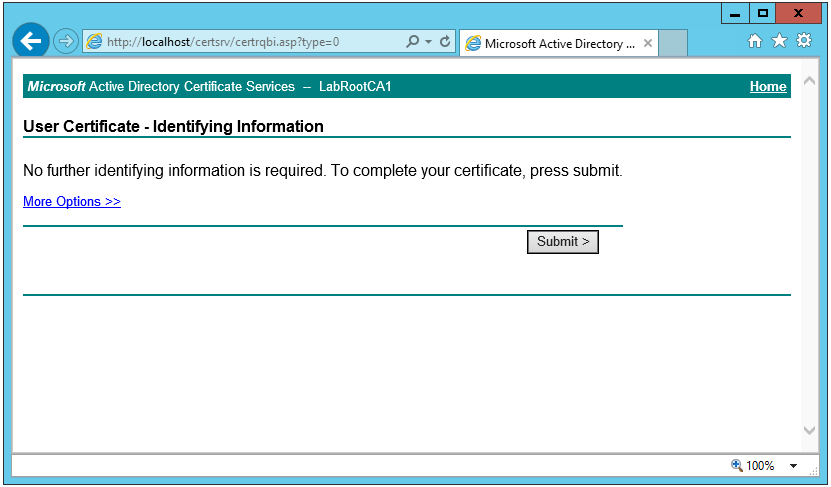{width="5.092307524059493in"
height="2.98198709536308in"}

Click **Submit**

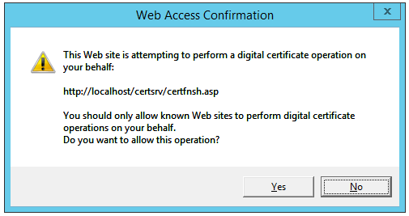{width="3.6846161417322834in"
height="1.9446719160104986in"}

Click **Yes**

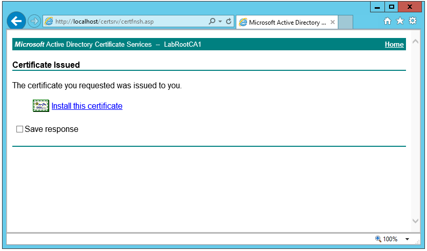{width="4.601222659667542in" height="2.7in"}

Click **Install this certificate**

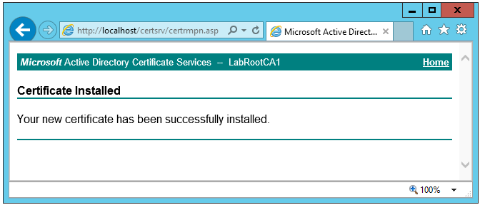{width="4.515384951881015in"
height="1.935165135608049in"}

Press **Windows key + R** and type **certmgr.msc** and press **enter**.
The Certificate Manager console appears. Now go to **Certificates -
Current User**, **Personal** and **Certificates**. Now, the certificate
can be viewed.

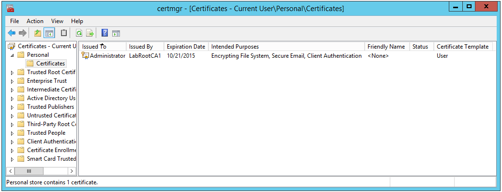{width="6.292361111111111in"
height="2.4229166666666666in"}

Double click the certificate

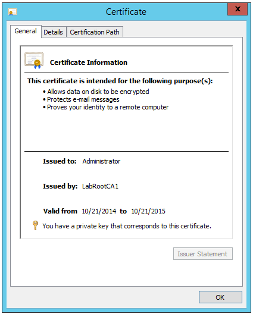{width="2.9846161417322836in"
height="3.7307699037620297in"}

**Congratulations**. You now have a user certificate issued to
contoso\\Administrator installed locally on the CA server!

### Requesting a certificate for a computer

It is of course also possible to request certificates for computers. We
will now perform a manual request using the certificates console on the
CA server.

On the CA server, Press **Windows key + R** and type **mmc** and press
**enter**

Click the **File** menu and click on **Add/Remove Snap-in**

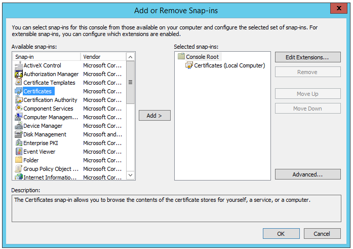{width="4.216959755030621in"
height="2.9692311898512687in"}

Click on **Certificates** and click on **Add**

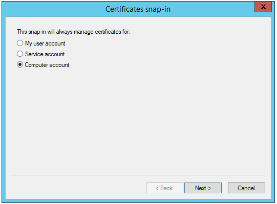{width="3.638462379702537in"
height="2.6807841207349083in"}

Select **Computer account** and click **Next**

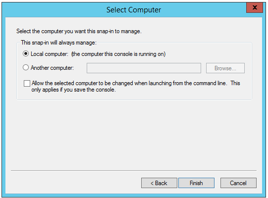{width="3.6923075240594927in"
height="2.7304615048118985in"}

Click **Finish**

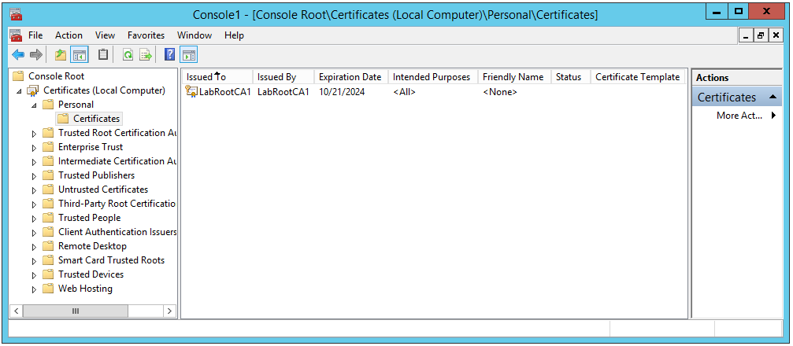{width="6.292361111111111in"
height="2.754166666666667in"}

The Root CA’s own certificate (license to be a Certificate Authority) is
of already present.

Now, under **Certificates (Local Computer) - Personal**, right click on
the **Certificates** folder and click **All Tasks** and then on
**Request New Certificate**.

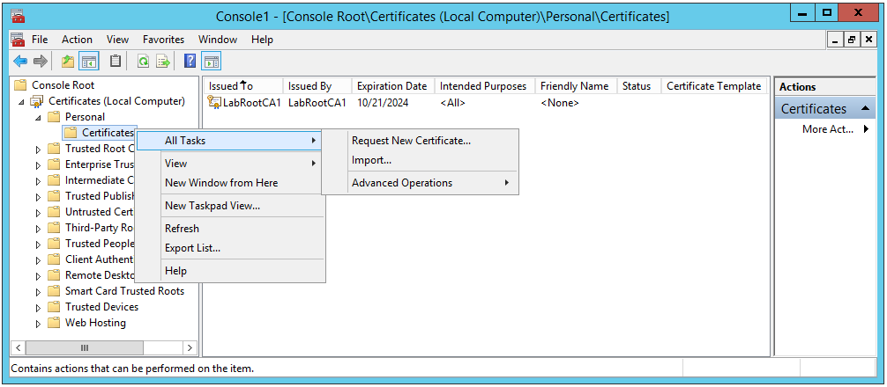{width="6.3in" height="2.754166666666667in"}

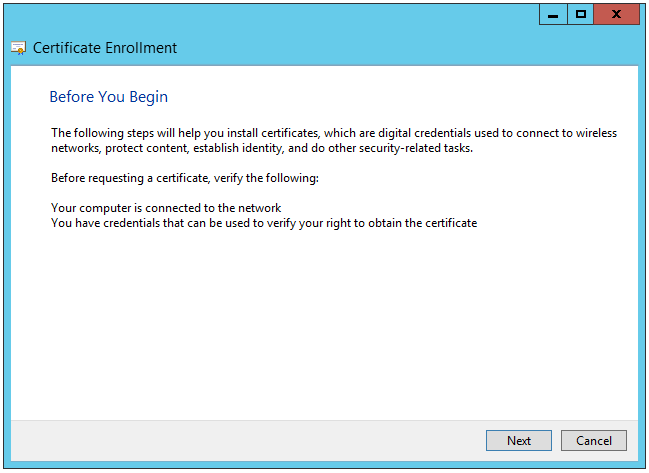{width="3.357257217847769in"
height="2.446154855643045in"}

Click **Next**

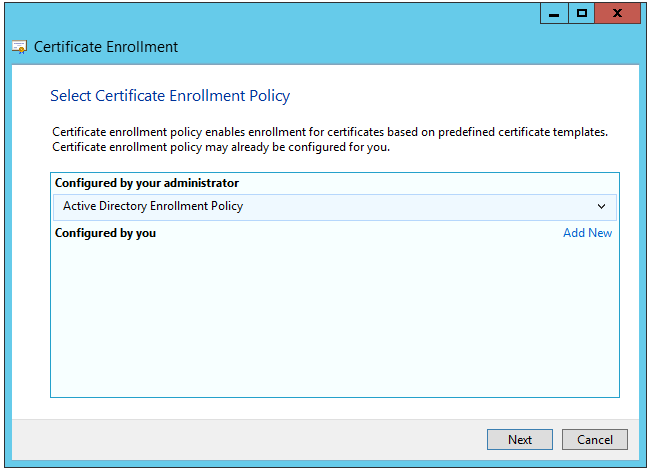{width="3.776923665791776in"
height="2.7348556430446194in"}

Click **Next**

**\
**

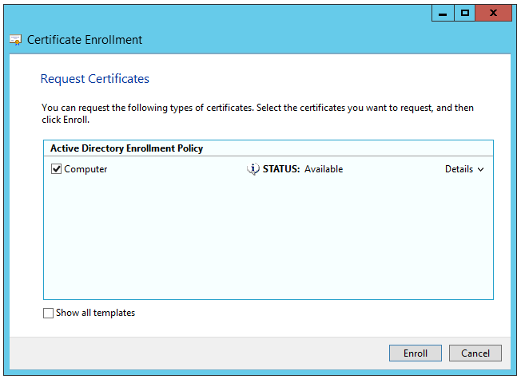{width="3.1393591426071743in"
height="2.2846161417322834in"}

Mark the check box next to **Computer** and click **Enroll**

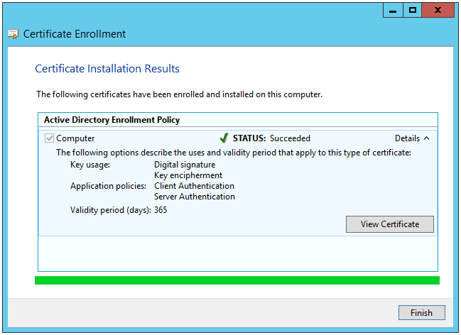{width="3.138462379702537in"
height="2.28292760279965in"}

Click on **Details** and click on **View Certificate**

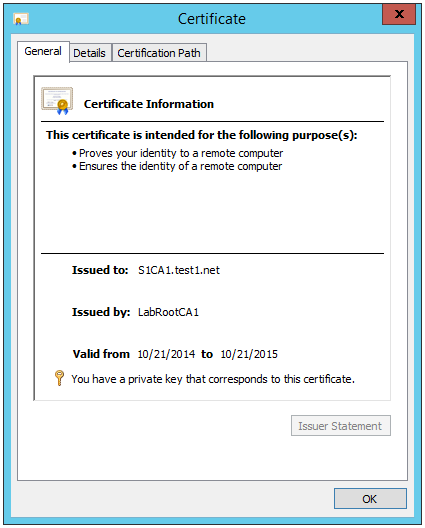{width="2.65213801399825in"
height="3.292308617672791in"}

**Congratulations**. Now you have issued a computer certificate for the
CA server!

### Enabling auto enrollment of certificates

Issuing a user certificate and a computer certificate was good fun.
However, it will not be so much fun if you deploy a lab with 10+
computers and 50+ users if you are to enroll 60 certificates manually!
Instead, you can configure auto enrollment using a few simple steps.

On the CA server, press **Windows key + R** and type **certtmpl.msc**
and press **enter**

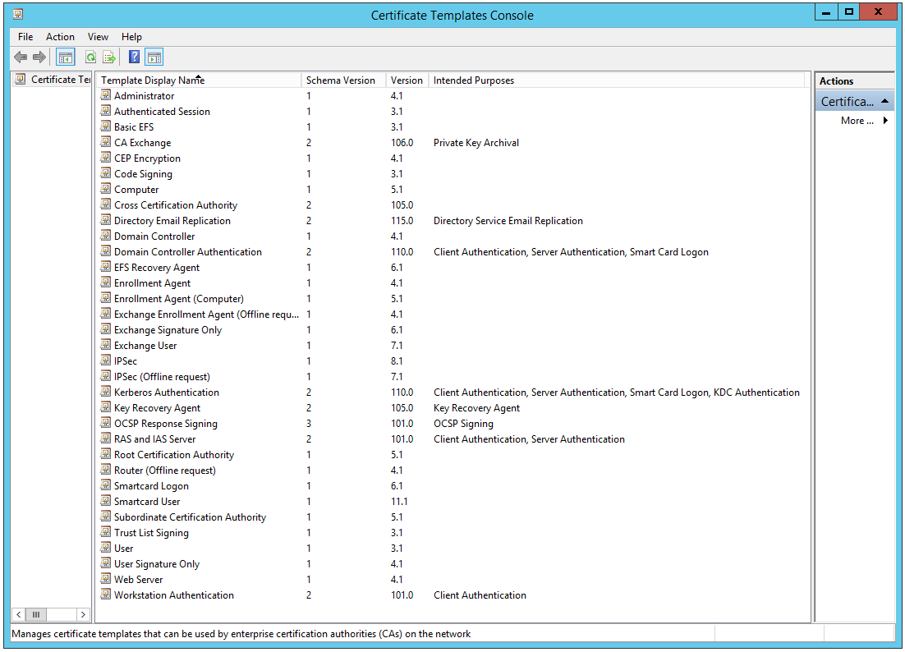{width="4.1818186789151355in"
height="3.0129418197725286in"}

All certificate templates are now displayed. These represent all the
different types of certificates (potentially) possible to be issued by
the CA server. Now, right click on the **Computer** certificate template
and click **Duplicate Template**.

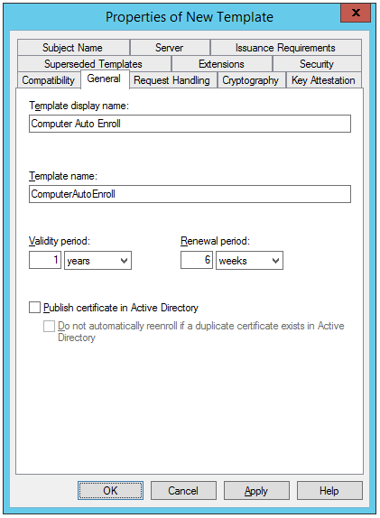{width="2.7629483814523184in"
height="3.765152012248469in"}

Change the Template display name to **Computer Auto Enroll**

**\
**

Go to the **Security** tab and click on **Domain Computers**.

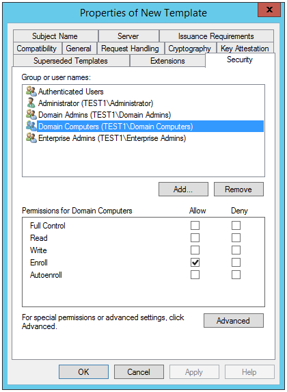{width="2.3060181539807525in"
height="3.1439391951006126in"}

Change the permissions to **Allow Read**, **Allow Enroll** and **Allow
Autoenroll**.

Next, add **Domain Controllers** with the same permissions.

Perform the same procedure for the **User** certificate template where
permissions for **Domain Users** are modified to **Allow Read**, **Allow
Enroll** and **Allow Autoenroll** *as well as for the user
**Administrator** specifically*. When duplicating the User certificate
template, additionally, go to the Subject Name tab and remove mark in
check boxes **Include e-mail name in** **alternate subject name** and
**E-mail name**.

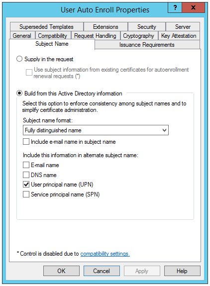{width="2.575757874015748in"
height="3.5129155730533683in"}

Next, still on the CA server, press **Windows key + R** and type
**certsrv.msc** and press **enter**

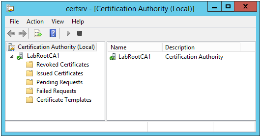{width="3.1818186789151355in"
height="1.6780063429571304in"}

Right click on **Certificate Templates** and click **New** and click
**Certificate Template** **to Issue**.

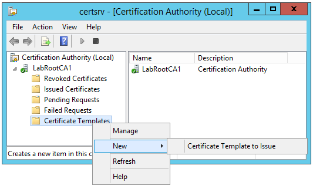{width="3.9751793525809274in"
height="2.401515748031496in"}

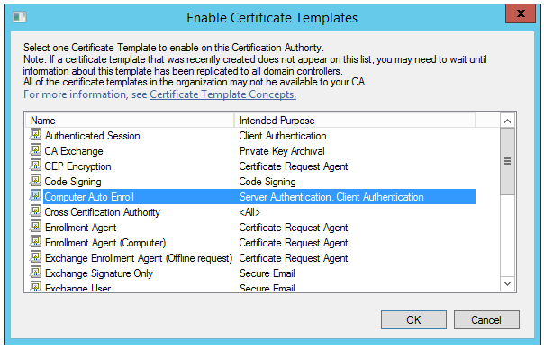{width="3.99666447944007in"
height="2.5681824146981627in"}

Click the newly created certificate template **Computer Auto Enroll**
and click **Ok**.

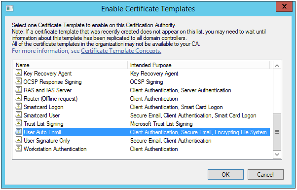{width="4.022727471566054in"
height="2.570038276465442in"}

And same procedure for the **User Auto Enroll** certificate template.

Now, the certificate templates on the CA server are in place and will be
issued by request. To make all computers and users automatically request
certificates, a Group Policy is needed configuring this.

Go to the domain controller and open **Group Policy Management Tool** by
pressing **Windows key + R** and type **gpmc.msc** and press **enter**

{width="4.166666666666667in"
height="2.7241819772528433in"}

Open **Forest: test1.net**, **Domains** and **test1.net**.

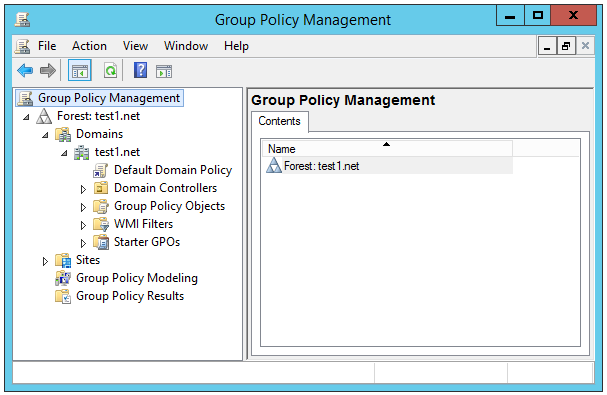{width="4.121212817147857in"
height="2.680213254593176in"}

Right click the **Default Domain Policy** and click **Edit**.

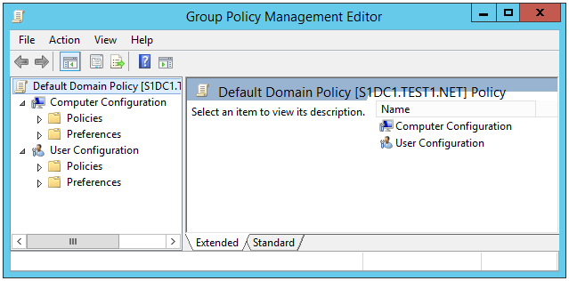{width="4.128788276465442in"
height="2.0423042432195975in"}

Open **Default Domain Policy** - **Computer Configuration** -
**Policies** - **Windows Settings** - **Security Settings** - **Public
Key Policies**.

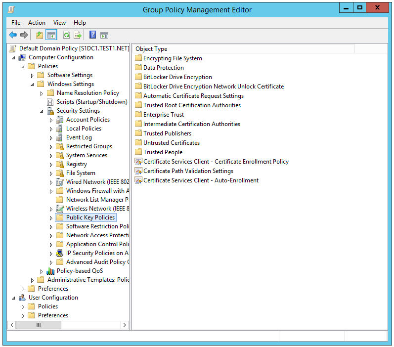{width="3.6895745844269467in" height="3.25in"}

Double click on the policy **Certificate Services Client -
Auto-Enrollment**.

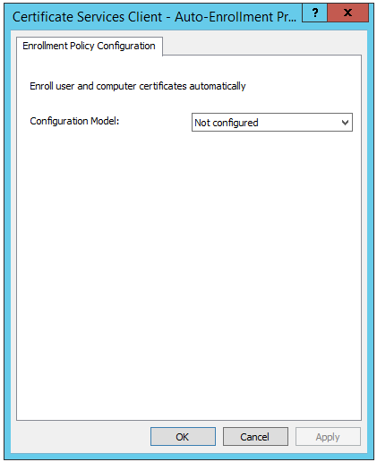{width="2.0325568678915134in"
height="2.4924245406824146in"}

Change the **Configuration Model** to **Enabled** and mark both check
boxes and click **OK**.

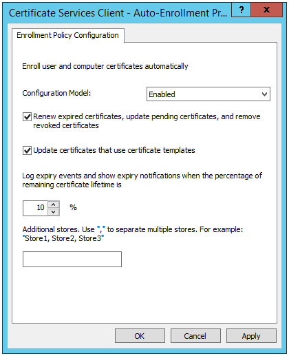{width="1.9848490813648294in"
height="2.4416316710411197in"}

Perform the exact same change for users under **Default Domain Policy**
- **User Configuration** - **Policies** - **Windows Settings** -
**Security Settings** - **Public Key Policies**

**\
**

Now, to test the auto enrollment, press **Windows key + R** and type
**mmc** and press **enter**.

Click the **File** menu and click on **Add/Remove Snap-in**

{width="4.216959755030621in"
height="2.9692311898512687in"}

Click on **Certificates** and click on **Add**

{width="3.638462379702537in"
height="2.6807841207349083in"}

Select **Computer account** and click **Next**

{width="3.6923075240594927in"
height="2.7304615048118985in"}

Click on **Certificates** once again and click on **Add**.

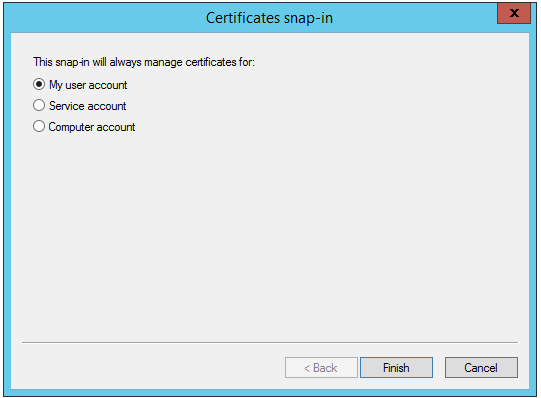{width="3.998008530183727in"
height="2.9393930446194227in"}

This time, select **My user account** and click **Finish**.

{width="3.907016622922135in"
height="2.45454615048119in"}

Open **Certificate (Local Computer)** - **Personal** - **Certificates**.

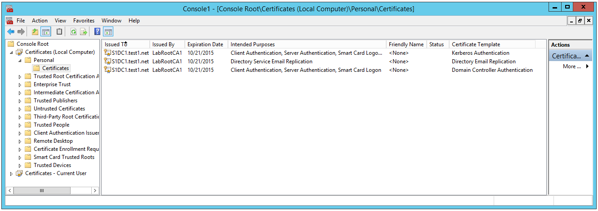{width="5.621212817147857in"
height="1.9840299650043745in"}

The list contains 3 certificates but none of these are issued from the
certificate templates we created earlier.

Next, go to **Certificate (Current User)** - **Personal** –
**Certificates**

**\
**

{width="5.522727471566054in"
height="2.5422069116360455in"}

Only one self-signed certificate is present. No certificates from our CA
server.

Now, perform a group policy update by opening a PowerShell console and
type:

**gpupdate /force**

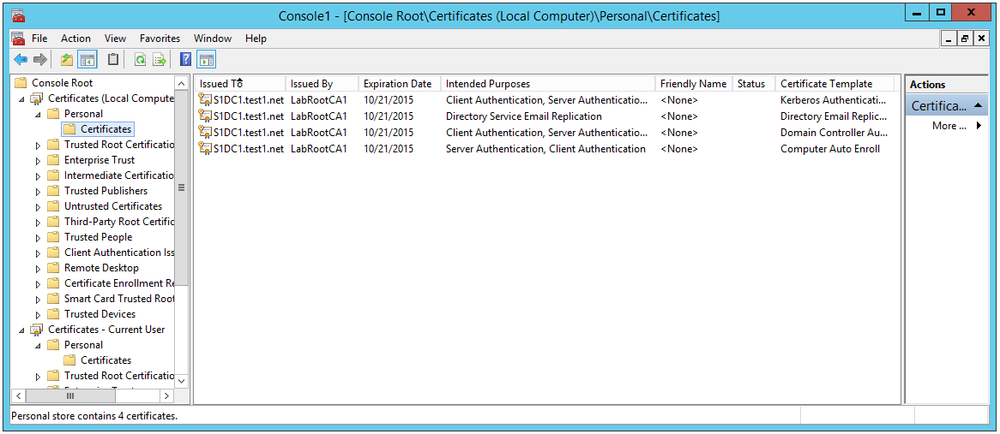{width="5.484849081364829in"
height="2.385349956255468in"}

Now, a certificate has been automatically issued to the domain
controller from our new certificate template.

Also, user certificate has been issued!

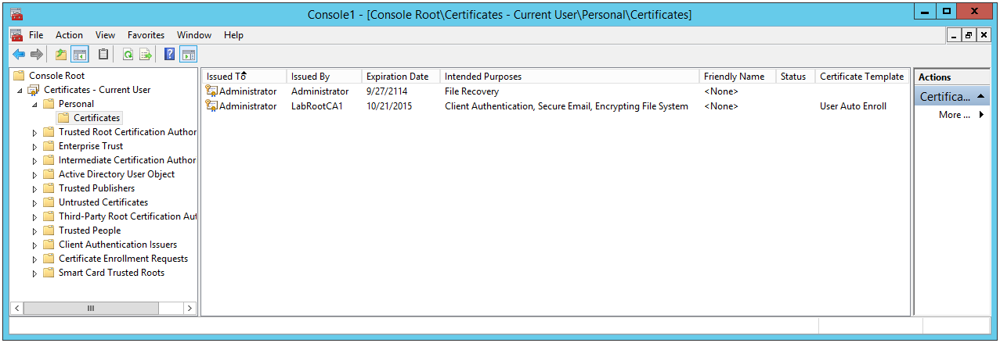{width="5.628788276465442in"
height="1.9326235783027121in"}

**Congratulations**. All new computers joined to the domain will now,
when they perform a group policy refresh, request a certificate and get
one automatically (which will basically happen when they restart first
time after joining the domain).

What is next
------------

The next article describes how to install a typical PKI hierarchy the
way this is typically setup in production. This would mean two CAs. One
with a type of Stand-Alone (the Root CA) and one with a type of
Enterprise (the Subordinate CA).

The Full Script
---------------

\$start = Get-Date

\#Some definitions about folder paths

\#This folder contains two sub folders

\# -ISOs - Stores all the DVD images

\# -PostInstallationActivities - any scripts to customize the
environment after installation

\$labSources = 'E:\\LabSources'

\$vmDrive = 'D:'

\$labName = 'PKISmall1'

\#this folder stores the XML files that contain all the information
about the lab

\$labPath = "\$vmDrive\\\$labName"

\#create the target directory if it does not exist

if (-not (Test-Path \$labPath)) { New-Item \$labPath -ItemType Directory
| Out-Null }

\#create an empty lab template and define where the lab XML files and
the VMs will be stored

New-LabDefinition -Path \$labPath -VmPath \$labPath -Name \$labName
-ReferenceDiskSizeInGB 60

\#make the network definition

Add-LabVirtualNetworkDefinition -Name \$labName -IpAddress 192.168.81.1
-PrefixLength 24

\#and the domain definition with the domain admin account

Add-LabDomainDefinition -Name test1.net -AdminUser administrator
-AdminPassword Password1

\#these images are used to install the machines

Add-LabIsoImageDefinition -Name Server2012 -Path
\$labSources\\ISOs\\en\_windows\_server\_2012\_r2\_with\_update\_x64\_dvd\_4065220.iso
-IsOperatingSystem

\#these credentials are used for connecting to the machines. As this is
a lab we use clear-text passwords

\$installationCredential = New-Object PSCredential('Administrator',
('Password1' | ConvertTo-SecureString -AsPlainText -Force))

\#the first machine is the root domain controller. Everything in
\$labSources\\Tools get copied to the machine's Windows folder

\$role = Get-LabMachineRoleDefinition -Role RootDC @{
DomainFunctionalLevel = 'Win2012R2'; ForestFunctionalLevel = 'Win2012R2'
}

Add-LabMachineDefinition -Name S1DC1 \`

-MemoryInMb 512 \`

-IsDomainJoined \`

-DomainName test1.net \`

-Network \$labName \`

-IpAddress 192.168.81.10 \`

-DnsServer1 192.168.81.10 \`

-InstallationUserCredential \$installationCredential \`

-ToolsPath \$labSources\\Tools \`

-OperatingSystem 'Windows Server 2012 R2 SERVERDATACENTER' \`

-Roles \$role

\#the second will be a member server configured as Root CA server.
Everything in \$labSources\\Tools get copied to the machine's Windows
folder

\$role = Get-LabMachineRoleDefinition -Role CaRoot

Add-LabMachineDefinition -Name S1CA1 \`

-MemoryInMb 512 \`

-IsDomainJoined \`

-DomainName test1.net \`

-Network \$labName \`

-IpAddress 192.168.81.20 \`

-DnsServer1 192.168.81.10 \`

-InstallationUserCredential \$installationCredential \`

-ToolsPath \$labSources\\Tools \`

-OperatingSystem 'Windows Server 2012 R2 SERVERDATACENTER' \`

-Roles \$role

\#This all has created the lab configuration in memory. Next step is to
export it to XML. You could have made the

\#lab definitions in XML as well or can do modifications in the XML if
this seems easier.

Export-LabDefinition -Force -ExportDefaultUnattendedXml

\#Set trusted hosts to '\*' and enable CredSSP

Set-LabHostRemoting

\#Now the XML files needed to be reimported. Some basic checks are done
for duplicate IP addresses, machine names, domain

\#membership, etc. If this reports errors please run "Test-LabDefinition
D:\\LabSettings\\Lab.xml" for more information

Import-Lab -Path (Get-LabDefinition).LabFilePath

\#Now the actual work begins. First the virtual network adapter is
created and then the base images per OS

\#All VMs are diffs from the base.

Install-Lab -NetworkSwitches -BaseImages -VMs

\#This sets up all domains / domain controllers

Install-Lab -Domains

\#Install CA server(s)

Install-Lab -CA

\#Start all machines what have not yet started

Install-Lab -StartRemainingMachines

\$end = Get-Date

Write-Host "Setting up the lab took \$(\$end - \$start)"
