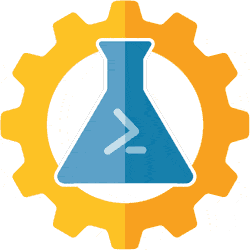

# AutomatedLab

AutomatedLab (AL) enables you to

- Set up lab and test environments
- On Hyper-v or Azure with multiple products
- Including just a single VM quickly.

**Require one**:

- .NET 4.7.1 (Windows PowerShell)
- .NET Core 2+ (PowerShell 6+)

**Require one**:

- Hyper-V Host
- Azure Subscription

**Finally**:

- Operating System DVD ISO Images

Build | Status | Last Commit | Latest Release
--- | --- | --- | ---
Develop |  | 
Master |  |  | 

## Tutorials

### Videos

- [Getting started with AutomatedLab](https://www.youtube.com/watch?v=lrPlRvFR5fA)

<!--
YouTube link is marked private: Checked on 2021-02-12 @ 1530 EST
- [How to automate ActiveDS lab to preform pentesting with Powershell &  Hyper-V?](https://www.youtube.com/watch?v=y0aid7U5e-0) *by @rajganeshp (Thanks!)* -->

### Scripts

- Official sample scripts in your local [LabSources](https://github.com/AutomatedLab/AutomatedLab/tree/develop/LabSources/SampleScripts) should cover many scenarios.
- [DSC Workshop Overview](https://github.com/dsccommunity/dscworkshop)

## Requirement

Apart from the module itself, your system needs to meet the following requirements:

1. .NET Core 2.x (PowerShell Core 6+) Preferred
2. Recommended en-us language Operating Systems language
3. Operating Systems ISO files for all roles to be deployed
4. Intel VT-x or AMD/V capable CPU
5. A generous amount of RAM
6. Low-Latency high-throughput storage (*No spinning disks, please, as there are issues related to them*)

### Windows

- Windows Management Framework 5+
- NET 4.7.1 (Windows PowerShell)
- Windows Server 2012 R2+/Windows 8.1+
- Admin privileges are required.

### Linux

- Ubuntu, Ubuntu WSL & Azure Cloud Shell supported
- Tested on Ubuntu. Due to fragmented nature of Linux distributions, we cannot support anything else.
- PowerShell Core 6+
- gss-ntlmssp to enable remoting (*mandatory - no remoting, no way for AutomatedLab to do its thing*)
  - If in doubt, try to `Install-Module PSWSMAN; Install-WSMAN` - no success warranted
- IP and route commands available
- **Azure subscription**
  - At the moment, AutomatedLab only works using Azure.
  - KVM planned for a later date.

## Supported products

This solution supports setting up virtual machines with the following.

1. Windows 7, 2008 R2, 8 / 8.1 and 2012 / 2012 R2, 10 / 2016, 2019, 2022
1. SQL Server 2008, 2008R2, 2012, 2014, 2016, 2017, 2019 [*more*](https://www.microsoft.com/en-us/sql-server)
1. Visual Studio 2012, 2013, 2015, 2017 [*more*](https://visualstudio.microsoft.com)
1. Team Foundation Services 2015+
1. Azure DevOps [*more*](https://azure.microsoft.com/en-us/services/devops/server/)
1. Exchange 2013, 2016, 2019
1. SharePoint 2013, 2016, 2019
1. System Center Orchestrator 2012
1. System Center Configuration Manager 1809 or 1902+
1. System Center Operations Manager
1. System Center Virtual Machine Manager
1. Microsoft Deployment Toolkit (MDT) [*more*](https://www.microsoft.com/en-us/download/details.aspx?id=54259)
1. ProGet (Private PowerShell Gallery)
1. Office 2013, 2016
1. DSC Pull Server (with SQL Reporting) [*more*](https://docs.microsoft.com/en-us/powershell/scripting/dsc/pull-server/pullserver/)
1. Hyper-V [*more*](https://docs.microsoft.com/en-us/virtualization/)
1. Failover Clustering [*more*](https://docs.microsoft.com/en-us/windows-server/failover-clustering/failover-clustering-overview/)
1. Dynamics 365 [*more*](https://docs.microsoft.com/en-us/dynamics365/customerengagement/on-premises/deploy/deploy-and-operate-dynamics-365-on-premises)

## Feature List

### Set-Up

- AutomatedLab (AL) makes setup easy
- A single machine is [three lines](https://github.com/AutomatedLab/AutomatedLab/blob/master/LabSources/SampleScripts/Introduction/01%20Single%20Win10%20Client.ps1).
- [Complex labs](https://github.com/AutomatedLab/AutomatedLab/blob/master/LabSources/SampleScripts/HyperV/BigLab%202012R2%20EX%20SQL%20ORCH%20VS%20OFF.ps1) in approximately 100 lines
- Scan these [sample scripts](https://github.com/AutomatedLab/AutomatedLab/tree/master/LabSources/SampleScripts)

### Environment

- A single command to connect Azure or Hyper-V Lab [*Learn more*](https://automatedlab.org/en/latest/Wiki/Advanced/connectlabs/)
- Composite scenarios to demo PowerShell Gallery resources
  - Inedo ProGet [*more*](https://github.com/AutomatedLab/AutomatedLab/blob/master/LabSources/SampleScripts/Scenarios/ProGet%20Lab%20-%20HyperV.ps1)
  - Desired State Configuration (DSC) Pull Service [*more*](https://github.com/AutomatedLab/AutomatedLab/blob/master/LabSources/SampleScripts/Scenarios/DSC%20Pull%20Scenario%201%20(Pull%20Configuration).ps1)
  - Multiple Active Directory Federation Services (ADFS) Forests Trusts [*more*](https://github.com/AutomatedLab/AutomatedLab/blob/master/LabSources/SampleScripts/Scenarios/Multi-AD%20Forest%20with%20Trusts.ps1)

### Configuration

Manage one, some, or all virtual lab machines

- Run Checkpoint-LabVM, Get-LabVMSnapshoft, Restore-LabVMSnapshot, Remove-LabVMSnapshot
- Get-LabWindows Feature,Install-LabWindowsFeature, Uninstall-LabWindowsFeature
- Get-LabSoftwarePackage, Install-LabSoftwarePackage(s)
- Silent installation mode available
  - MSI & EXE supported
  - Parallel workflows supported
- Invoke-LabDscConfiguration
- Invoke-LabCommand to run Script & ScriptBlock
- CredSsp is always enabled to use with the UseCredSsp switch

### Network

- Multi-Virtual Network Adapter to create DMZs
- External, Internal & Private network supported
- DHCP, DNS, IPAM, NLB, SMB supported
- Routing & Remote Access Service (RRAS)
- Single Domain, Routing & File Server with DMZ [lab](https://github.com/AutomatedLab/AutomatedLab/blob/master/LabSources/SampleScripts/Introduction/05%20Single%20domain-joined%20server%20(internet%20facing).ps1)

### Management

- Single command offline patching
- All lab machines use one disk per OS
- Update-LabIsoImage Efficiently patch  OS ISO files [*more*](https://github.com/AutomatedLab/AutomatedLab/blob/master/LabSources/SampleScripts/Introduction/11%20ISO%20Offline%20Patching.ps1)
- Remove-Lab obliterate lab with one command

## Telemetry

Starting with AutomatedLab version 5, we are collecting telemetry. To see what you guys deliver, we are sharing the resulting Power BI report with you.  You can view the [full report] at your leisure. To learn more about what is collected, see [here](https://automatedlab.org/en/latest/Wiki/About/telemetry/).

### Facts and figures

<iframe width="100%" height="600" src="https://app.powerbi.com/view?r=eyJrIjoiMmYyYTdmODUtMDJlZS00M2QwLWE1MDgtMGU5YTkyODVhZmQ2IiwidCI6Ijc5MzlmZDI1LTQ0YjktNGNjMC04YjVkLWRmZGZjYTg2ZTZlYyIsImMiOjl9&pageName=ReportSection67b5abc401bbec55e899" frameborder="0" allowFullScreen="true"></iframe>

### Country distribution

<iframe width="100%" height="600" src="https://app.powerbi.com/view?r=eyJrIjoiMmYyYTdmODUtMDJlZS00M2QwLWE1MDgtMGU5YTkyODVhZmQ2IiwidCI6Ijc5MzlmZDI1LTQ0YjktNGNjMC04YjVkLWRmZGZjYTg2ZTZlYyIsImMiOjl9&pageName=ReportSectiona46e290f733ccaa8ef5f" frameborder="0" allowFullScreen="true"></iframe>

### Role distribution

<iframe width="100%" height="600" src="https://app.powerbi.com/view?r=eyJrIjoiMmYyYTdmODUtMDJlZS00M2QwLWE1MDgtMGU5YTkyODVhZmQ2IiwidCI6Ijc5MzlmZDI1LTQ0YjktNGNjMC04YjVkLWRmZGZjYTg2ZTZlYyIsImMiOjl9&pageName=ReportSectionae759e8d989baffad8d4" frameborder="0" allowFullScreen="true"></iframe>

### Version distribution

<iframe width="100%" height="600" src="https://app.powerbi.com/view?r=eyJrIjoiMmYyYTdmODUtMDJlZS00M2QwLWE1MDgtMGU5YTkyODVhZmQ2IiwidCI6Ijc5MzlmZDI1LTQ0YjktNGNjMC04YjVkLWRmZGZjYTg2ZTZlYyIsImMiOjl9&pageName=ReportSection3edbf550bbd6493af421" frameborder="0" allowFullScreen="true"></iframe>

[AutomatedLab]: https://github.com/AutomatedLab/AutomatedLab
[wiki]: https://github.com/AutomatedLab/AutomatedLab/wiki
[full report]: https://app.powerbi.com/view?r=eyJrIjoiMmYyYTdmODUtMDJlZS00M2QwLWE1MDgtMGU5YTkyODVhZmQ2IiwidCI6Ijc5MzlmZDI1LTQ0YjktNGNjMC04YjVkLWRmZGZjYTg2ZTZlYyIsImMiOjl9
## Next Steps

- [1. Installation](https://automatedlab.org/en/latest/Wiki/Basic/install/)

- [2. Getting started](https://automatedlab.org/en/latest/Wiki/Basic/gettingstarted/)

- [3. Contributing](https://github.com/AutomatedLab/AutomatedLab/blob/master/CONTRIBUTING.md)

### Change Log

- [Version History](https://github.com/AutomatedLab/AutomatedLab/blob/master/CHANGELOG.md)